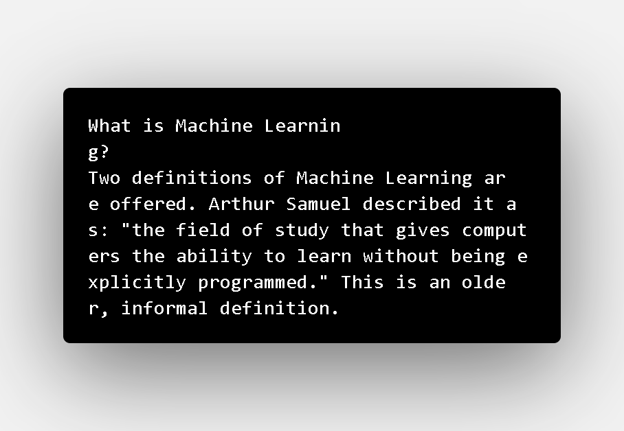

# Machine Learning Notes

<code></code>&nbsp;

Nothing just indexing here. :)

## INDEX
1. Definition of Machine Learning ([Machine Learning](https://github.com/sohampod/machineLearningnotes/blob/main/MachineLearning.md))
2. Supervised Learning ([Supervised Learning](https://github.com/sohampod/machineLearningnotes/blob/main/SupervisedLearning.md))
3. Unsupervised Learning ([Unsupervised Learning](https://github.com/sohampod/machineLearningnotes/blob/main/UnsupervisedLearning.md))
4. Lectures PDF(s) ([Lecture PDF](https://github.com/sohampod/machineLearningnotes/tree/main/lecturePDF))
5. Octave Matrix commands ([Octave Commnands](https://github.com/sohampod/machineLearningnotes/blob/main/octaveMatrix&Vector.md))
6. Octave Commands ([Octave Commnands](https://github.com/sohampod/machineLearningnotes/blob/main/OctaveCommands.txt))
7. Exercise 1 ML coursera ([Exercise 1](https://github.com/sohampod/machineLearningnotes/tree/main/ex1-octave))
8. Sqaure & Cube function ([Sqaure & Cube](https://github.com/sohampod/machineLearningnotes/tree/main/squareAndCube))
9. Optimised Algorithm ([optimisedAlgorithm](https://github.com/sohampod/machineLearningnotes/tree/main/optimisedAlgorithmExample))
10. Exercise 2 ML coursera ([Exercise 2](https://github.com/sohampod/machineLearningnotes/tree/main/ex2-octave))
11. Neural Networks ([Neural Networks](https://github.com/sohampod/machineLearningnotes/tree/main/neuralNetworks))